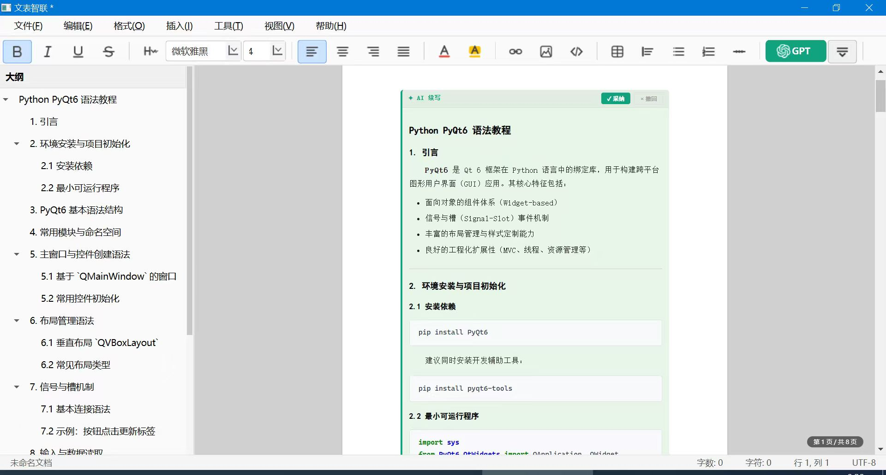
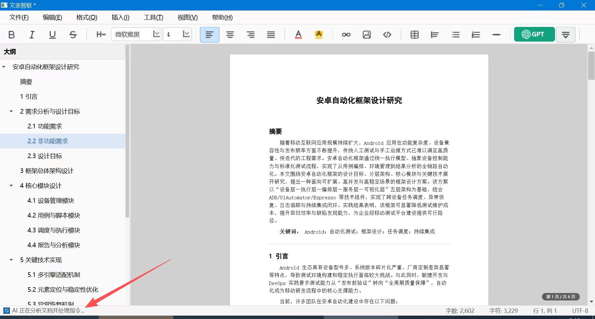
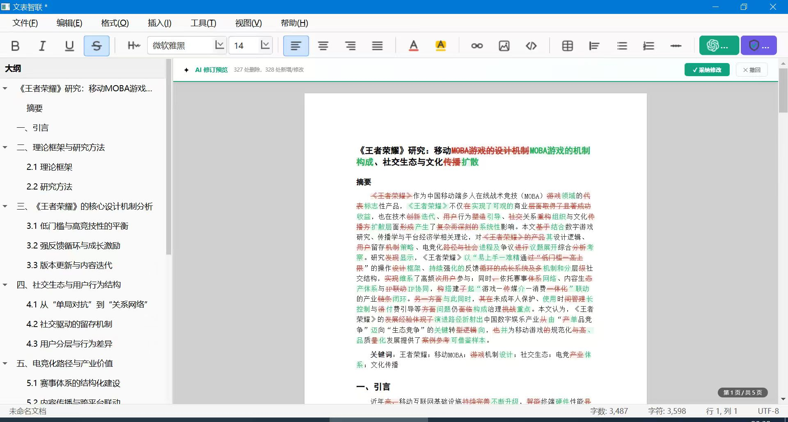
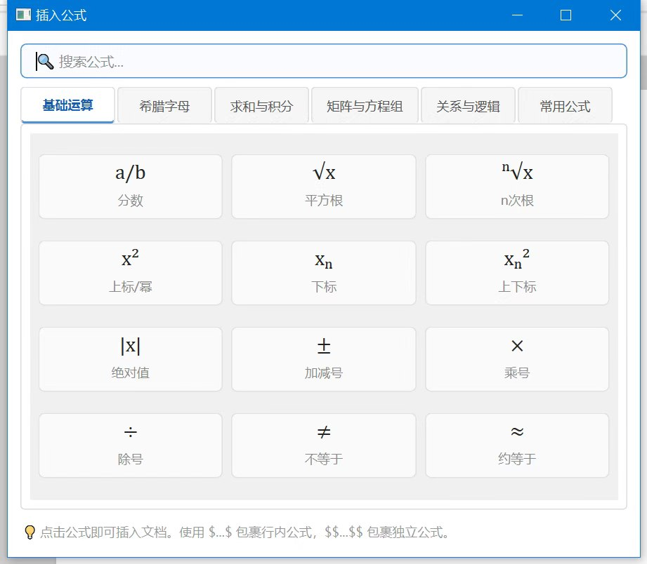
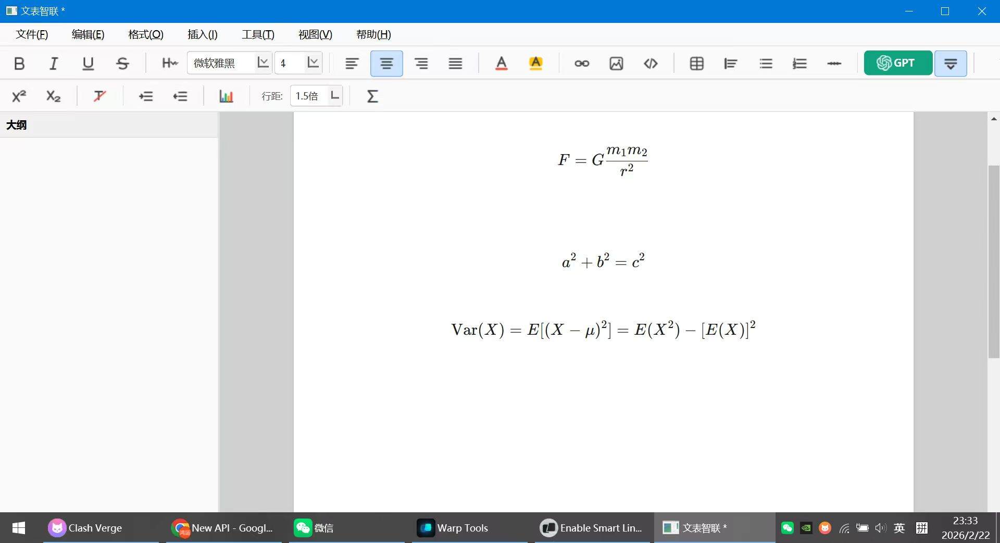
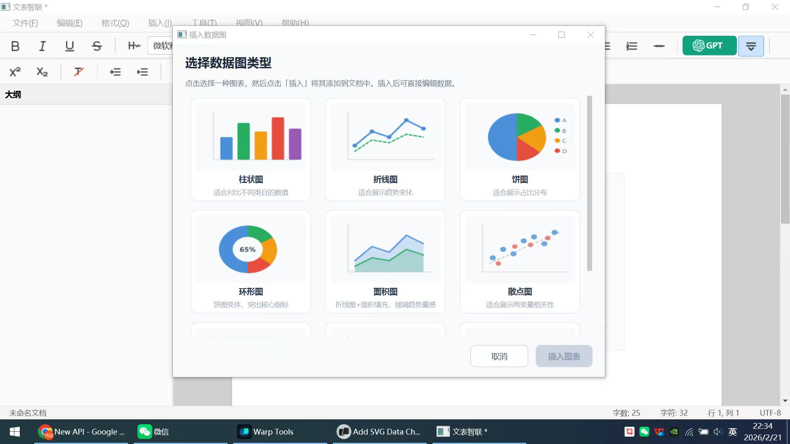
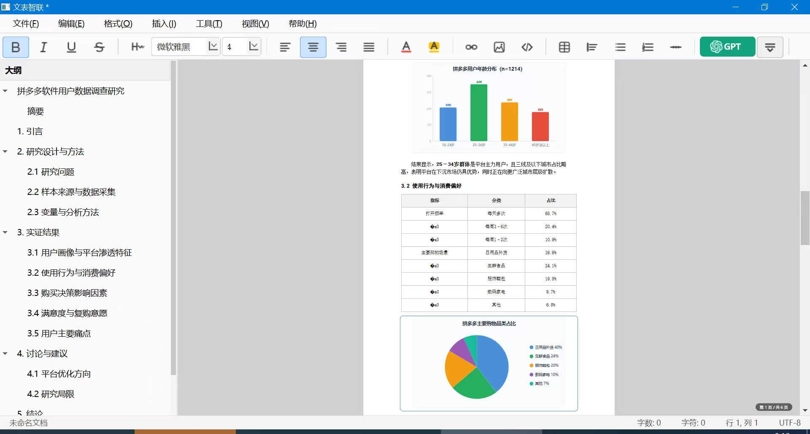
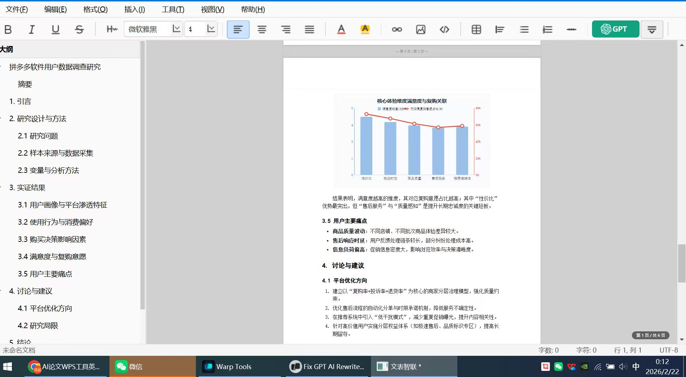

<div align="center">

# ThesisX · 文表智联

**学术论文智能写作工具**

Markdown 编辑 · AI 辅助写作 · LaTeX 公式 · 数据图表 · 查重 · 一键导出 Word/PDF/PPT

[](https://python.org)
[](https://www.riverbankcomputing.com/software/pyqt/)
[](LICENSE)

</div>

---

## 📸 功能展示

### 编辑器主界面

左侧文档大纲 + 中央 Markdown 编辑器 + 右侧实时预览，三栏联动。



### AI 智能写作与修订

AI 自动生成论文内容，修订结果以红绿 Diff 对比呈现，一键接受或撤回。




### LaTeX 数学公式

内置公式面板，点击即插入；支持行内 `$...$` 与块级 `$$...$$` 实时渲染。

<p align="center">
  
  
</p>

### 数据图表与可视化

内置柱状图、折线图、饼图、散点图等，插入后自动渲染到文档中。

<p align="center">
  
  
</p>

### 学术论文排版预览

论文大纲导航、参考文献、图表混排，所见即所得。



---

## ✨ 功能特点

- **Markdown 编辑器** — 语法高亮、行号、自动补全括号与列表
- **实时预览** — 编辑器与预览面板同步滚动，多主题切换（学术 / 现代 / 经典）
- **文档大纲** — 自动提取标题，点击跳转
- **AI 写作助手** — 智能续写、润色、修订，支持 Diff 对比与章节批处理
- **Skills 集群记忆** — 添加需求文件、规范文档，AI 自动读取作为上下文
- **数学公式** — 支持 LaTeX 行内 / 块级公式，内置可视化公式面板
- **数据图表** — 柱状图、折线图、饼图、环形图、面积图、散点图
- **论文查重** — 集成查重服务，提交前自查文本相似度
- **多格式导出** — HTML、PDF、Word（DOCX，符合中文学术排版规范）、PPT
- **论文模板** — 学位论文、学术论文、文献综述等内置模板
- **查找与替换** — 大小写匹配、全词匹配、全部替换
- **自动保存** — 每 5 分钟自动保存，配置持久化

---

## 🚀 快速开始

### 环境要求

- Python 3.10+

### 安装

```bash
pip install -r requirements.txt
```

### 运行

```bash
python main.py
```

---

## 🔑 AI Key 配置

启用 AI 写作助手前，请配置 API Key。程序按以下优先级读取：

1. `WENBIAO_AI_API_KEY`
2. `AI_API_KEY`
3. `OPENAI_API_KEY`

```powershell
# PowerShell — 当前会话
$env:WENBIAO_AI_API_KEY = "你的APIKey"

# PowerShell — 永久生效（需重启终端）
setx WENBIAO_AI_API_KEY "你的APIKey"
```

---

## ⌨️ 快捷键速查

| 操作 | 快捷键 | 操作 | 快捷键 |
|------|--------|------|--------|
| 新建 | `Ctrl+N` | 加粗 | `Ctrl+B` |
| 打开 | `Ctrl+O` | 斜体 | `Ctrl+I` |
| 保存 | `Ctrl+S` | 标题 1–6 | `Ctrl+1~6` |
| 导出 Word | `Ctrl+E` | 代码块 | `Ctrl+K` |
| 查找 | `Ctrl+F` | 插入表格 | `Ctrl+T` |
| 替换 | `Ctrl+H` | 插入链接 | `Ctrl+L` |

---

## 📁 项目结构

```
ThesisX/
├── main.py                     # 程序入口
├── requirements.txt
├── app/
│   ├── constants.py            # 应用常量
│   ├── styles.py               # UI 样式
│   ├── core/
│   │   ├── ai_service.py       # AI 写作服务
│   │   ├── markdown_renderer.py
│   │   ├── math_renderer.py    # LaTeX 公式渲染
│   │   ├── chart_generator.py  # 数据图表生成
│   │   ├── docx_exporter.py    # Word 导出
│   │   ├── pptx_exporter.py    # PPT 导出
│   │   ├── plagiarism_service.py # 查重服务
│   │   ├── context_compressor.py # 大文档压缩
│   │   └── ...
│   ├── ui/
│   │   ├── main_window.py      # 主窗口
│   │   ├── editor_widget.py    # 编辑器
│   │   ├── preview_widget.py   # 实时预览
│   │   ├── chart_dialog.py     # 图表对话框
│   │   ├── formula_dialog.py   # 公式面板
│   │   ├── skills_dialog.py    # Skills 记忆管理
│   │   └── ...
│   ├── shortcuts/              # 快捷键管理
│   └── resources/              # 静态资源与模板
└── tests/                      # 测试用例
```

---

## 📄 开源协议

[MIT License](LICENSE)
